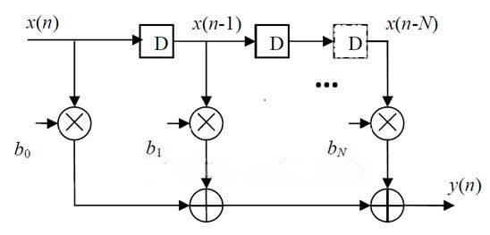

# VHDL Low-Pass FIR Filter for ECG Denoising  

This repository contains the VHDL implementation of a Low-Pass FIR Filter designed for ECG denoising. The filter eliminates high-frequency noise, preserving essential signal characteristics for accurate biomedical signal analysis.

---

## Introduction  

ECG signals are susceptible to high-frequency noise, which can interfere with accurate diagnosis. A Finite Impulse Response (FIR) low-pass filter is implemented in VHDL to reduce noise and enhance signal fidelity. This project demonstrates a hardware-friendly design for FPGA-based systems. 

---

## Features  

- **Customizable Filter Coefficients**: Easily adaptable for various cutoff frequencies.  
- **Hardware Efficient**: Optimized for FPGA and ASIC implementations.  
- **High Precision**: Reduces noise without distorting the ECG signal.  

---

## Block Diagram  

  

The block diagram illustrates the data flow: input buffering, coefficient multiplication, and output summation.

---

## Simulation Results  

.png)  

The graph shows the performance of the filter in denoising a noisy ECG signal.

---

## Project Setup  

### Prerequisites  

- VHDL simulation tools: ModelSim, Vivado, Quartus, etc.  
- FPGA Development Board (optional).  

